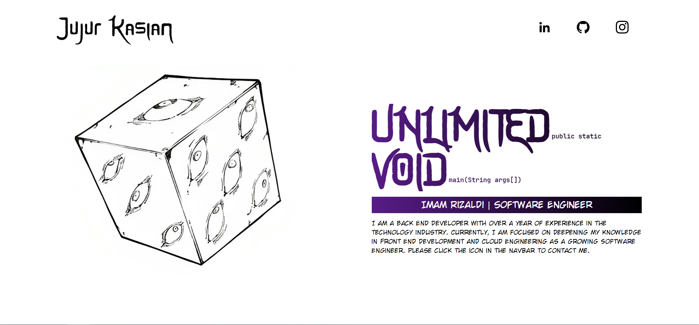
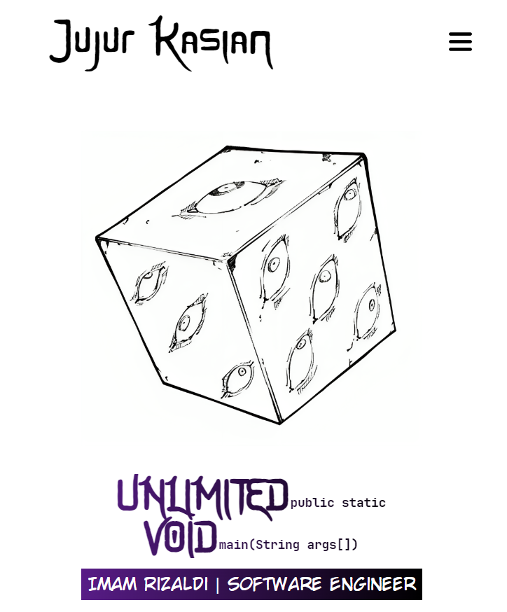

# Jujutsu Kaisen based Portfolio Website

## Sneakpeak:
- Web

- Mobile

Hello, this is repository for my personal portfolio web^^

After deciding to learn Back-End Development for over 1 year, I chose to expand my Front-End skills by learning how to build web with React + TailwindCSS.

This web also contains some `weebs`🗿 reference, especially **The Honored One**. #RIPGojo

I'll keep developing this web; I know there are many aspects lacking, but I also have many features I want to add in my head.

## Features ⭐
- Links to your social media, such as LinkedIn, GitHub, and Instagram.
- Personal portfolio display with information about yourself, experience, and skills.
- References and quotes from favorite anime and manga (Coming Very Soon).
- Projects you've worked on with descriptions and links to their repositories (Coming Soon).
- Tech articles that I wrote (Coming Soon).

## Tech Stack ⚙
- React
- TailwindCSS
- HTML/CSS